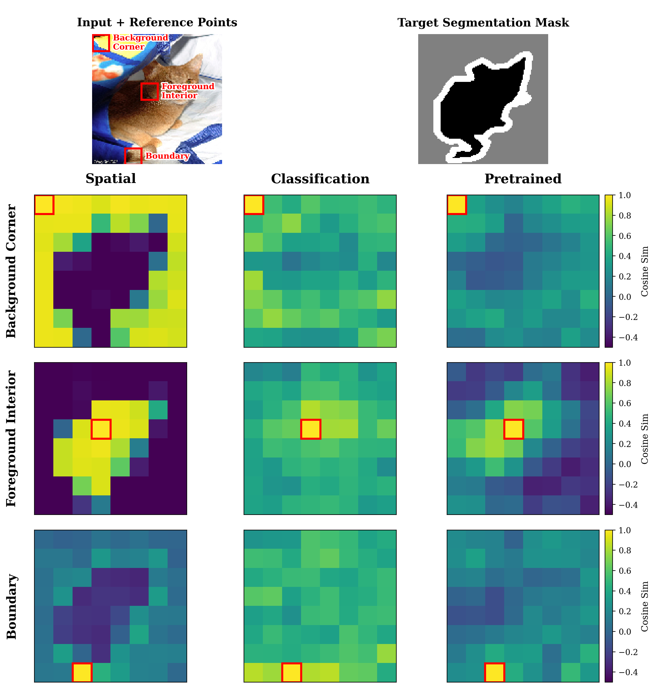

# Diminishing Returns in Self-Supervised Learning

This is an implementation of *[Simple Masked Image Modelling (SimMIM)](https://arxiv.org/abs/2111.09886)*, a self-supervised learning framework for pre-training vision transformers for downstream tasks such as classification or segmentation. A [VisionTransformer](https://arxiv.org/abs/2010.11929) model is pre-trained on the [ImageNet-1K](https://www.image-net.org/) dataset and fine-tuned on the [Oxford-IIIT Pets](https://www.robots.ox.ac.uk/~vgg/data/pets/) dataset for segmentation.

We investigate the effects of intermediate fine-tuning on the [Intel Image Classification](https://www.kaggle.com/datasets/puneet6060/intel-image-classification) dataset with both global (classification-based) and spatially aligned (patchwise) supervision, performed before segmentation training. To analyze how these intermediate objectives reshape internal representations, we include patch-level diagnostics and visualizations, such as variance decomposition, cosine similarity as a function of spatial distance, linear patch probes, and qualitative patch-token similarity heatmaps. These tools make explicit how different forms of supervision affect patch-level geometry and downstream performance. See the [technical report](arxiv.pdf) for details.

Four random reconstruction samples from the pre-trained encoder (from left to right: original image, masked image and reconstruction):


Four random samples of segmentation predictions from the fine-tuned model (from left to right: original image, ground-truth segmentation map and predicted map):


After intermediate fine-tuning under different supervision geometries, we visualize the resulting patch-level representation structure by plotting cosine similarity between a reference patch token and all other patches in the image. These visualizations reveal how classification-based intermediate objectives disrupt spatial coherence, while spatially aligned supervision preserves localized and semantically organized patch structure: 
<p align="center">
  
</p>


### Requirements
This project requires Python 3.10 and packages listed in `requirements.txt`.
To install required packages, run the command:
```bash
pip install -r requirements.txt
```
in your virtual environment.
## Usage
### Self-Supervised Pre-Training with SimMIM on ImageNet-1K

1. Run the following to start pre-training (with the default settings used in the report, on a smaller subset of data):
   ```bash
   python main_pretrain.py \
		--config vit_4M_pretrain \
		--train_size 10000 \
		--download_imagenet
	```

   This will first download and extract the compressed ImageNet files, then start printing training statistics and save the model weights as a `.pth` file every epoch. Use the flag `--run_plots` to save reconstructions during training, and the `--val_set` flag to use the smaller (validation) set only, for quicker testing. Change the train size between 45k, 100k and 200k to reproduce results from the report.
   
>Note the full download may take upwards of **4 hours**, depending on your connection. You may choose to download the validation set and the devkit files only and train on this smaller subset, in which case use the `--val_set` flag. 

>\[Optional] Manual downloads: Navigate to the project's `/data/` folder and download ImageNet-1K by either running these commands below in a bash command line, or manually using the links to these 3 files ([devkit](https://image-net.org/data/ILSVRC/2012/ILSVRC2012_devkit_t12.tar.gz), [validation](https://image-net.org/data/ILSVRC/2012/ILSVRC2012_img_val.tar), [train](https://image-net.org/data/ILSVRC/2012/ILSVRC2012_img_train.tar)):
```bash
cd data
wget https://image-net.org/data/ILSVRC/2012/ILSVRC2012_devkit_t12.tar.gz --no-check-certificate
wget https://image-net.org/data/ILSVRC/2012/ILSVRC2012_img_val.tar --no-check-certificate
wget https://image-net.org/data/ILSVRC/2012/ILSVRC2012_img_train.tar --no-check-certificate
```
### Fine-Tuning on Oxford-IIIT Pets
1. With the pre-trained encoder weights in the `/weights/` folder, run this command for fine-tuning, which will download the Oxford-IIIT Pets dataset and start training initialised with the weights given:
   ```bash
	python main_finetune.py \
		--config vit_4M_finetune \
		--train_size 6000 \
		--test_size 1000 \
		--weights weights/encoder_vit_4M_pretrain_200K.pth
	```
   
   Loss is printed every epoch while test set pixel accuracy and mean IoU is calculated after training is complete.
   Segmentation predictions will be saved under `/figures/`. Change the train size to reproduce results from the report.
2. To run a baseline model with **no pre-training**, omit the `--weights` argument, i.e. use the following command:
   ```bash
	python main_finetune.py \
		--config vit_4M_finetune \
		--train_size 6000 \
		--test_size 1000
	```

### Intermediate Classification Fine-Tuning on Intel Image Classification Dataset
With the pre-trained encoder weights in the `/weights/` folder, run the following command to perform intermediate fine-tuning on this dataset, followed by segmentation fine-tuning on Oxford-IIIT Pets:
```bash
python main_finetune.py \
	--config vit_4M_finetune \
	--train_size 6000 \
	--test_size 1000 \
	--weights weights/encoder_vit_4M_pretrain_200K.pth \
	--int_finetune
```

First, the Intel Image Classification dataset will be automatically downloaded. You may choose to do this manually via:
```bash
cd data
wget https://huggingface.co/datasets/miladfa7/Intel-Image-Classification/resolve/main/archive.zip?download=true
```
	        
### Evaluation
To plot reconstructions from pre-trained models on ImageNet validation set (download above):
```bash
	python evaluation.py \
		--config vit_4M_pretrain \
		--weights weights/mim_vit_4M_pretrain_200K.pth
```

To evaluate a fine-tuned segmentation model on the Oxford-IIIt Pets test set, use a command like the following, replacing the weights with those saved after fine-tuning (see above):
```bash
	python evaluation.py \
		--config vit_4M_finetune \
		--weights weights/vit_4M_finetune_data_250.pth \
		--test_size 1000 \
		--train_size 250
```

### Visualizing Supervision Geometry
1. First, train separate encoder variants under different intermediate supervision objectives (classification-based and spatial) starting from the same pretrained checkpoint. The objectives described in the technical report are defined at the top of `main_intermediates.py`:
```bash
	python main_intermediates.py \
		--config vit_4M_finetune \
		--pretrained-path weights/mim_vit_4M_pretrain_200K.pth
```

2. Then, report diagnostics such as variance decomposition and cosine similarity as a function of spatial distance. When enabled, the visualization flag produces patch-token cosine similarity heatmaps (reference patch vs. all patches), while the probe flag reports final patch-level classification accuracy on frozen representations.
```bash
	python diagnostics.py \
		--config vit_4M_finetune \
		--verbose \
		--viz-patch-sim \
		--viz-savepath figures/patch_sim.png \
		--do-probe
```
